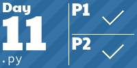
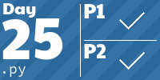

# Advent of Code 2023

My solutions for [Advent of Code](https://adventofcode.com/2023) in 2023. Probably done mostly in Python 3.12 🐍 (or C++23 👨‍💻 or Rust 🦀).

Rules:

- Python: No external libraries, only the standard library. (Crates are allowed for Rust.)
- Always a **general** solution, not just for the input. Any input should work.
- A short runtime. No brute force solutions.

Other:

- `solutions/` contain the source files to solve the problem, one for each day. Executable via stdin to print both results. Keep in mind they are _cleaned_ solutions.
- Tiles below are generated via [aoc-tiles](https://github.com/LiquidFun/aoc_tiles).

<!-- AOC TILES BEGIN -->
<h1 align="center">
  2023 - 47 ⭐
</h1>

<!-- AOC TILES END -->